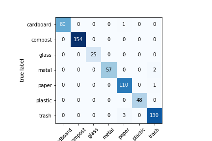

# Using FastAI for creating a Waste Classifier

Fastai is a deep learning library which provides high-level components that can quickly and easily provide state-of-the-art results in standard deep learning domains.

It has two main design goals:

To be approachable and rapidly productive
To be also configurable.

## Waste Classifier
The aim is to build a model for waste classification that identifies among the different classes:

- cardboard
- compost
- glass
- metal
- paper
- plastic
- trash

This machine learning model will help people to improve their decision when classifying trash

## Dataset 
The data is already splitted in train and test folders. Inside each folder contains one folder for each class. Those images were obtained using Bing searcher using the api HTTP.
You can find the code used to download the images at [this](https://colab.research.google.com/drive/1JvAYFx1DIEi1MMyI-tuCfE2eHMSKisKT?usp=sharing) Google Colab.

## Model 
You can find the code for the classifier [here](resnet-model.ipynb)
To load the model in the file result-resnet34.pkl or esult-resnet50.pkl
Those are the files for the trained models using resnet34 and resnet50 

The model reaches an accuracy of 0.98, here we can see the confusion matrix:

## Usage 
Check this [Google Colab](https://colab.research.google.com/drive/1qMxyoVngHiV6E2ePu54o5PiJFr5Ifhku?usp=sharing) to use the model with your own images. 

